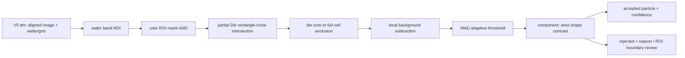

# Particle Inspection V1

## 목적

V5의 `build_die_map(image, ...) -> dm` 결과를 받은 뒤, **wafer 외곽 band 안의 particle**만 별도로 검사한다. `is_edge`는 die의 위치 속성이고, particle은 defect 결과다. 따라서 이 모듈의 band ROI는 `is_edge`와 독립적으로 설정한다.

이 폴더의 `use_particle_wafer_band_v1.py`는 기존 Gray particle 파일과 다른 이름의 독립 배포본이다. V5 파일을 수정하거나 다른 `WaferDieMap` 클래스를 import하지 않는다.

## 검토 반영 사항

이번 분리본은 particle 검토에서 확인된 문제를 다음처럼 반영한다.

| 확인된 문제 | V1 반영 |
|---|---|
| V5 `dm`과 particle 모듈의 클래스가 달라 직접 호출 불가 | 클래스 `isinstance` 검사 대신 V5 공통 필드만 확인 |
| 중심이 원 밖인 partial Die가 mask에서 누락 | 모든 theoretical cell에 사각형-원 교차 검사 적용 |
| grid cell 전체 mask가 street particle까지 제거 | `die_core`와 `grid_cell` 모드 분리 |
| 고정 흰색 threshold가 조명 변화에 취약 | local background residual + MAD adaptive threshold |
| band 경계에서 잘린 blob도 정상 처리 가능 | `touches_roi_boundary`와 `rejection_reason` 반환 |
| 3000x3000 mask 반환으로 메모리 증가 | 기본 `return_masks=False`, 진단에서만 mask 반환 |

## 호출 순서

```python
from wafer_die_map_v5 import build_die_map
from use_particle_wafer_band_v1 import (
    ParticleInspectionConfig,
    inspect_particles_in_wafer_band,
    render_particle_diagnostic_overlay,
)

# 1. V5가 wafer 중심, radius, grid, angle-aligned image를 만든다.
dm = build_die_map(image, grid_method="corner", edge_mode="both")

# 2. 필요하면 호출부에서 특정 wafer 외곽만 허용한다. 0=제외, nonzero=검사.
user_roi = None

# 3. particle 검사는 V5 dm을 그대로 받는다.
result = inspect_particles_in_wafer_band(
    dm,
    config=ParticleInspectionConfig(
        band_inner_margin_px=75,
        band_outer_margin_px=10,
        die_exclusion_mode="die_core",
        die_core_inset_px=2,
        partial_die_policy="exclude_all",
    ),
    valid_region_mask=user_roi,
    return_masks=True,  # 양산 호출은 False 권장
)

overlay = render_particle_diagnostic_overlay(dm, result)
```

## 검사 로직



1. Band는 wafer edge에서 `inner_margin`만큼 안쪽부터 `outer_margin` 전까지다. 기본 `75~10 px`이고 guard `2 px`를 더 비워 경계에서 잘린 blob을 줄인다.
2. 모든 grid cell을 재생성하고 **die 중심이 아니라 사각형-원 교차**로 wafer에 걸친 partial Die도 찾는다.
3. full/partial Die 처리 정책을 분리한다. 기본은 partial Die 전체를 가려 강한 Die 내부 흰 패턴의 오검출을 막는다.
4. 검사 ROI에서 Gaussian local background를 빼고, residual의 median/MAD로 threshold를 자동 계산한다. 약하지만 주변보다 밝은 particle도 후보가 된다.
5. area, aspect ratio, fill ratio, local contrast, ROI 경계 접촉 여부를 평가한다. 탈락 후보도 사유를 남긴다.

## 핵심 파라미터

| 파라미터 | 의미 | 시작값 |
|---|---|---:|
| `band_inner_margin_px` | wafer edge에서 검사 시작점 | 75 |
| `band_outer_margin_px` | rim 노이즈를 피하기 위해 남길 외곽 폭 | 10 |
| `die_exclusion_mode` | `none`, `grid_cell`, `die_core` | `die_core` |
| `die_core_inset_px` | `die_core`에서 남길 street 폭 | 2 |
| `partial_die_policy` | partial Die 전체 또는 core만 제외 | `exclude_all` |
| `min_residual_px` | local background보다 최소 밝아야 할 값 | 16 |
| `residual_mad_z` | wafer별 adaptive threshold 강도 | 5.0 |
| `reject_roi_boundary_touch` | band 경계에 잘린 후보를 reject/review | True |

`grid_cell`은 오검출을 가장 강하게 막지만 street particle도 놓칠 수 있다. `die_core`는 street 검사를 남기는 권장 시작 모드다. partial Die는 내부 흰 회로가 바깥에 노출될 수 있으므로 처음에는 `exclude_all`을 사용하고, 실제 검증 이미지에서 누락이 확인될 때만 `die_core`로 완화한다.

## 반환값

```python
result = {
    "particles": [...],
    "rejected": [...],
    "summary": {...},
    "config": {...},
    "inspection_radii_px": {"inner": ..., "outer": ...},
    "masks": {...},  # return_masks=True일 때만
}
```

각 `particles` 항목은 다음을 포함한다.

| 키 | 설명 |
|---|---|
| `id` | 최종 통과 particle 번호 |
| `center_px`, `bbox_px` | `dm.aligned_image` 기준 좌표 |
| `nearest_die_index` | V5 격자 기준 가장 가까운 die index |
| `distance_from_wafer_edge_px` | wafer rim에서 안쪽으로의 거리 |
| `mean_intensity`, `mean_residual`, `local_contrast` | 밝기 판정 근거 |
| `area_px`, `aspect_ratio`, `fill_ratio` | 형상 판정 근거 |
| `particle_confidence` | 정렬/검토 우선순위용 0~1 점수 |
| `touches_roi_boundary` | band/user ROI 경계에 걸렸는지 |
| `coordinate_space` | 항상 `aligned` |

`rejected`에는 동일한 측정값과 `rejection_reason` 목록이 들어간다. `summary.review_required=True`이면 ROI 경계에 걸려 잘린 후보가 있다는 뜻이므로 사람이 overlay를 확인해야 한다.

## 메모리와 검증

3000x3000에서 uint8 mask 5장은 약 45 MB다. 따라서 기본 `return_masks=False`는 결과 목록과 통계만 돌려준다. 디버그 시에만 `True`로 설정한다.

회귀 테스트는 아래 명령으로 실행한다.

```powershell
python PARTICLE_INSPECTION_V1\test_particle_wafer_band_v1.py
```

현재 테스트는 street particle 검출, Die 내부 밝은 신호 제외, V5형 dm 직접 호환, diagnostic overlay 생성을 검증한다. 실제 양성/음성 wafer 정답지는 별도로 추가해 precision/recall 기준으로 threshold를 고정해야 한다.
